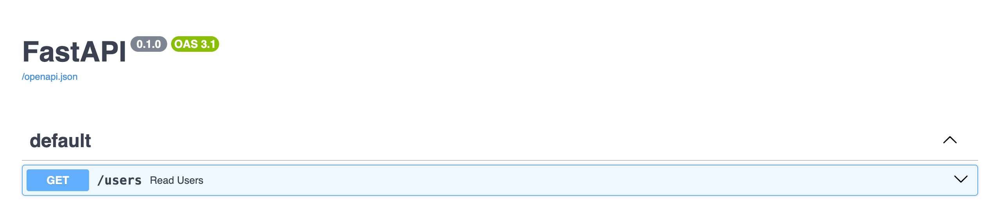
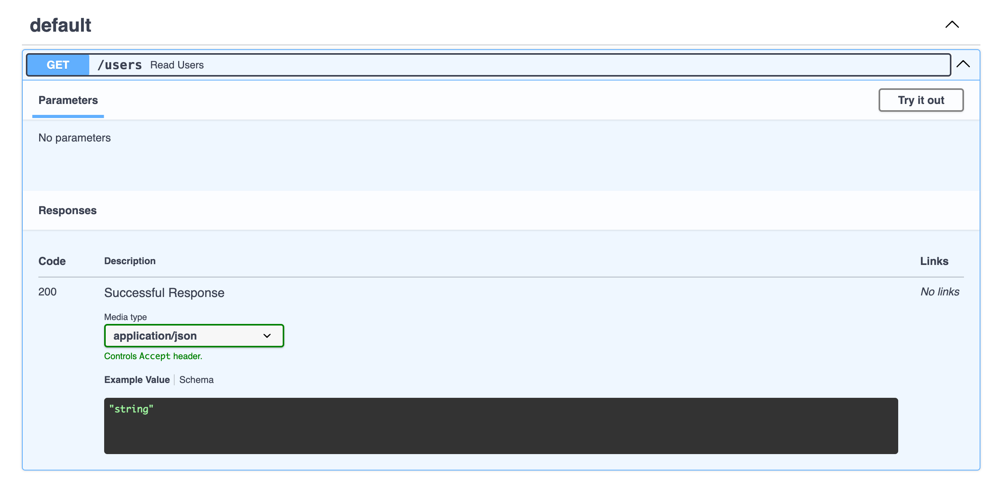
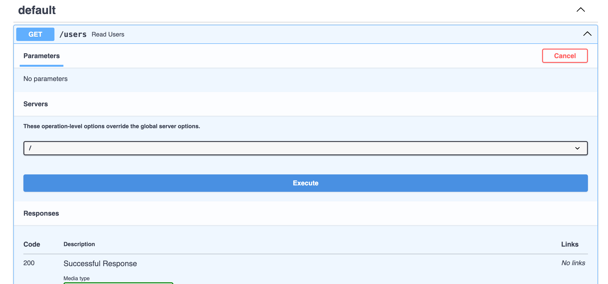
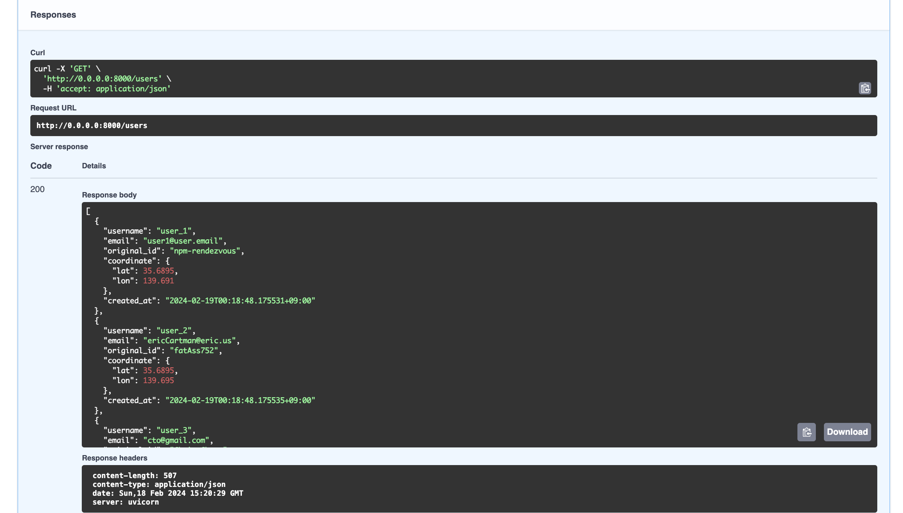

# dotpal-app

# Backend start up instruction

## Running on local python environment
If you already have python installed, simply go to the directory `backend/` with the following commands and then run `app.py`. 

```bash
cd backend
python app.py
```

Note that you need to install the modules listed in `requirements.txt` by the following command. 

```bash
pip install -r requirements.txt
```

# Swagger UI
You can check the responses from the endpoints directly on SwaggerUI (without any frontend).
Access link:

<a>http://0.0.0.0:8000/api/docs</a>

Note that first you need to get the server running. (i.e., execute `app.py`)

## Trying endpoints on Browser

1. You'll see the landing page like this.



1. Expand the Read Users endpoint section.



3. Click `Try it out` button.



4. Call the endpoint by clicking `Execute` button, and then you will see the responses from it. (JSON)


